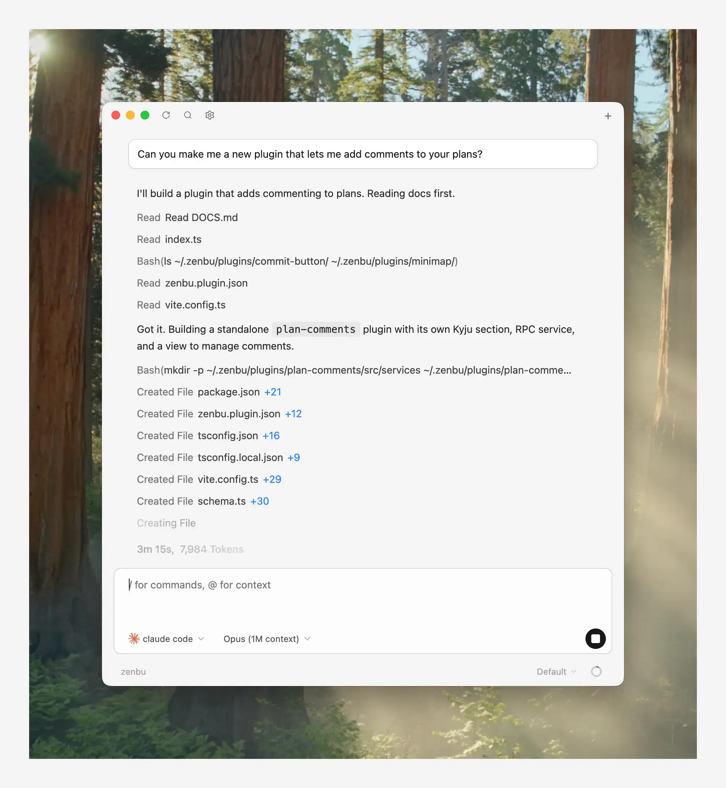

<p align="center">
  
</p>

<h1 align="center">Zenbu</h1>

<p align="center">
  <br>
  The extensible coding agent GUI.
</p>

<p align="center">
  
</p>

## Installation

Download the latest build from [zenbu.dev/download](https://www.zenbu.dev/download) or [GitHub Releases](https://github.com/zenbu-labs/zenbu/releases).

When you launch the app, this repo will be cloned under ~/.zenbu/plugins. You can modify any source code of the app in this directory and changes will hot reload.

### Dependencies:

- git

## Plugins

Zenbu is built out of plugins. Plugins are units of code that can modify the app's behavior.

Plugins are configured at `~/.zenbu/config.jsonc`:

```
{
  "plugins": [
    ...your plugin paths here
  ]
}
```

The plugin API is not yet stable or complete, but you can reference the [core plugin](https://github.com/zenbu-labs/zenbu/tree/main/packages/init) to learn about what plugin API's are available and how to setup a plugin

## Configuring agents

Zenbu ships with **codex**, **claude**, **cursor**, **opencode**, and **copilot** preconfigured. It assumes you've already authenticated whichever one you want to use through its own CLI. You can add more agents (that are [acp compatible](https://agentclientprotocol.com/get-started/registry)) inside Zenbu Settings.

## `zen` CLI

```bash
zen                     # open a new window
zen --agent claude      # open with a specific agent
zen init my-plugin      # scaffold a new plugin
zen doctor              # re-run setup if something looks off
zen link                # regenerate registry types after editing a service or schema
```

### Inspect the database

Zenbu's state lives in a local reactive database named kyju, query it via the `zen` cli:

```bash
zen kyju db root                # full root document
zen kyju db collections         # list every collection
zen kyju db collection <id>     # page through a collection
```

When you change a plugin's schema, generate a migration with:

```bash
zen kyju generate --name add_my_field
```

### Script the running app

`zen exec` lets you call remote procedures exposed by plugins via [zenrpc](https://github.com/zenbu-labs/zenbu/tree/main/packages/zenrpc):

```bash
zen exec -e 'console.log(await rpc.cli.listAgents())'
zen exec -e 'const a = await rpc.cli.listAgents(); console.log(a.agents.length)'
zen exec ./my-automation.ts
```

Run `zen --help` for the full list of subcommands.

## Some notes

This is a very early project and may include breaking changes on any commit

If an agent or update breaks your code, `git stash` inside `~/.zenbu/plugins/zenbu`, or delete `~/.zenbu/` and the app will reinstall itself on next launch.
