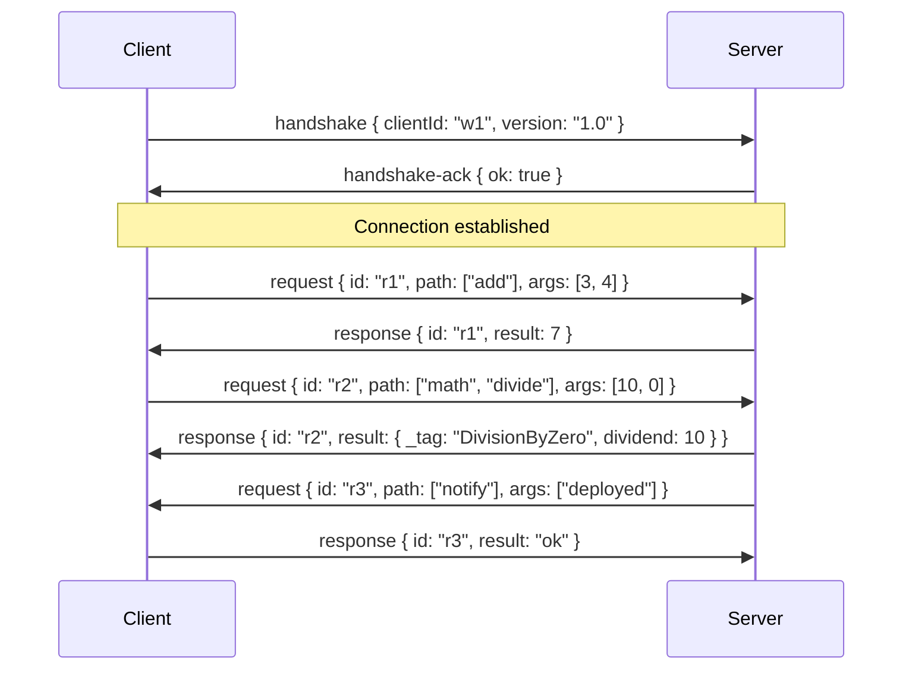

# ZenRPC Protocol

A transport-agnostic bidirectional RPC protocol for one-to-many topologies. One server defines a router; many clients connect, each with their own router. Either side can call the other's methods. Router methods may optionally return Effect values, in which case expected errors are serialized as a discriminated union rather than rejecting the call.

## Topology

- **Server** — The single node. Defines one router (via a factory that receives caller context). Manages connections from multiple clients. Targets specific clients by ID when calling their methods.
- **Client** — One of many nodes. Each identifies itself with a unique `clientId`. Defines its own router as a plain object. Calls server methods through a typed proxy.

The naming is arbitrary — the server is not necessarily an HTTP server, and clients are not necessarily browsers. The distinction is purely structural: one server, many clients.

## Transport

The protocol is transport-agnostic. Messages are JSON-serialized strings. Neither side dictates how messages are transported. The transport must deliver messages in order.

### Server Transport

The server is configured with a single `send` function that accepts a message and a target `clientId`. The transport is responsible for routing the message to the correct client.

```
send: (data: string, clientId: string) => void
```

The server exposes a single `postMessage` function. The transport calls it when a message arrives from any client, providing the sender's `clientId`.

```
postMessage: (data: string, clientId: string) => void
```

### Client Transport

Each client is configured with a `send` function that delivers messages to the server.

```
send: (data: string) => void
```

Each client exposes a `postMessage` function. The transport calls it when a message arrives from the server.

```
postMessage: (data: string) => void
```

## Routers

A router is a plain object whose leaves are functions. Objects may be nested to any depth. Functions at the leaves are the callable methods.

```
type Router = {
  [key: string]: ((...args: any[]) => any) | Router
}
```

### Server Router

The server router is a factory function. It receives a `getCtx` getter that returns a mutable context object for the current caller. The factory is invoked once per client upon successful handshake.

```
(getCtx: () => { clientId: string }) => Router
```

Methods call `getCtx()` at invocation time to read the current context.

### Client Router

The client router is a plain object — no factory, no context. The server already knows which client it is targeting.

### Type Export

Each side exports the type of its router for the other side to import. These must be type-only imports to avoid circular runtime dependencies.

```
// server-side
export type ServerRouter = ReturnType<typeof serverRouter>

// client-side
export type ClientRouter = typeof clientRouter
```

## Versioning

Both sides declare a version string. The version is exchanged during the handshake. If the versions do not match, the connection is rejected. The version is an opaque string — the protocol does not interpret it.

## Messages

All messages are JSON objects with a `type` discriminant.

| Type | Direction | Description |
|---|---|---|
| `handshake` | client -> server | Initiates a connection. |
| `handshake-ack` | server -> client | Accepts or rejects a connection. |
| `request` | bidirectional | Invokes a remote method. |
| `response` | bidirectional | Returns a method's result. |
| `error-response` | bidirectional | Returns an unrecoverable error. |

### Handshake

```
{ type: "handshake", clientId: string, version: string }
```

Sent by the client immediately upon creation. The server compares the version to its own.

### Handshake Ack

```
{ type: "handshake-ack", ok: boolean, error?: string }
```

Sent by the server in response to a handshake.

- `ok: true` — connection established. The server instantiates the router factory for this client.
- `ok: false` — connection rejected. `error` contains a human-readable reason (e.g. version mismatch).

No requests may be processed before a successful handshake. Requests received before handshake are rejected with an error-response.

### Request

```
{ type: "request", id: string, path: string[], args: unknown[] }
```

Invokes a method on the remote side's router.

- `id` — unique identifier for correlating the response.
- `path` — the key path to the method in the router object (e.g. `["users", "get"]` for `router.users.get`).
- `args` — the arguments to pass to the method, JSON-serialized.

### Response

```
{ type: "response", id: string, result: unknown }
```

Returns the result of a successful method call. `id` matches the originating request.

For Effect methods, `result` is one of:
- `{ _tag: "success", data: <value> }` — the method succeeded.
- `{ _tag: "<ErrorTag>", ...fields }` — the method failed with an expected tagged error.

For plain (non-Effect) methods, `result` is the return value directly.

### Error Response

```
{ type: "error-response", id: string, error: { message: string } }
```

Returned when:
- A method throws an exception.
- A method path does not resolve to a function.
- A request arrives before handshake.
- An Effect method encounters a defect (unexpected failure).

The caller's pending promise is rejected with an `Error` containing the message.

## Method Execution

When a request arrives, the receiver resolves the method by walking the `path` through its router object. If any segment is missing or the leaf is not a function, an error-response is sent.

The method is invoked with the deserialized `args`. The return value determines the response:

### Plain Methods

If the return value is not an Effect, it is awaited (in case it is a Promise) and sent as a `response` with the raw result.

### Effect Methods

If the return value is an Effect (detected at runtime via `Effect.isEffect`), it is run to completion via `Effect.runPromiseExit`. The exit determines the response:

| Exit | Response |
|---|---|
| Success | `response` with `result: { _tag: "success", data: <value> }` |
| Failure with tagged error (`_tag` present) | `response` with `result: { _tag: "<ErrorTag>", ...serialized fields }` |
| Failure without tag | `error-response` |
| Defect | `error-response` |

Tagged errors are serialized by extracting own enumerable properties, excluding `stack`, `name`, `cause`, and function-valued or symbol-keyed properties. The `_tag` field is always preserved.

## Typed Proxy

Each side accesses the remote router through a proxy object that provides full type safety. The proxy uses `Proxy` with:

- **`get` trap** — records the property name and returns a new proxy, building up the method path.
- **`apply` trap** — serializes the accumulated path and arguments into a `request` message, sends it, and returns a `Promise` that resolves when the corresponding `response` arrives.

Each request is assigned a unique ID. A pending request map tracks outstanding promises and resolves or rejects them when responses arrive.

### Proxy Type

The `RouterProxy<T>` type recursively transforms a router:

- Functions become Promise-returning: `(args) => R` becomes `(args) => Promise<Awaited<R>>`.
- Effect-returning functions become: `(args) => Effect<A, E>` becomes `(args) => Promise<EffectResult<A, E>>`.
- Nested objects become nested proxies.

`EffectResult<A, E>` is a discriminated union on `_tag`:
- If `E` is `never`: `{ _tag: "success", data: A }`.
- If `E` has tagged errors: `{ _tag: "success", data: A } | SerializedError<E>`.

`SerializedError<E>` strips Error/Effect internals from a tagged error type, keeping `_tag` and user-defined data fields.

## Connection Lifecycle

### Client Connects

Clients self-register through the handshake. The server does not need to know about clients ahead of time.

1. Client is created with `clientId`, `version`, router, and a `send` function.
2. Client immediately sends a `handshake` message containing its `clientId` and `version`.
3. Transport delivers the message to the server's `postMessage(data, clientId)`.
4. Server compares versions. On mismatch, sends `handshake-ack { ok: false }`.
5. On match, server auto-registers the client: instantiates the router factory with a `getCtx` getter bound to this client's ID, sends `handshake-ack { ok: true }`.
6. Client resolves its `ready` promise. RPC calls may now proceed in both directions.

### Client Disconnects

1. Server calls `removeClient(clientId)`.
2. All pending outbound requests to that client are rejected.
3. The client entry is removed from the server's internal map.

## Server API

```
createServer<TClientRouter>({ router, version, send })
  -> { postMessage, removeClient, client }
```

- `postMessage(data, clientId)` — feed an incoming message from a client. The transport identifies the sender.
- `removeClient(clientId)` — disconnects a client, rejects its pending requests.
- `client(clientId)` — returns a `RouterProxy<TClientRouter>` for calling that client's methods.

## Client API

```
createClient<TServerRouter>({ router, version, clientId, send })
  -> { postMessage, server, ready, connected }
```

- `postMessage(data)` — feed incoming messages from the server.
- `server` — a `RouterProxy<TServerRouter>` for calling server methods.
- `ready` — a `Promise<void>` that resolves when the handshake succeeds (rejects on failure).
- `connected` — boolean indicating whether the handshake has completed.

## Example

A server with a math router and a client with a notification router.


